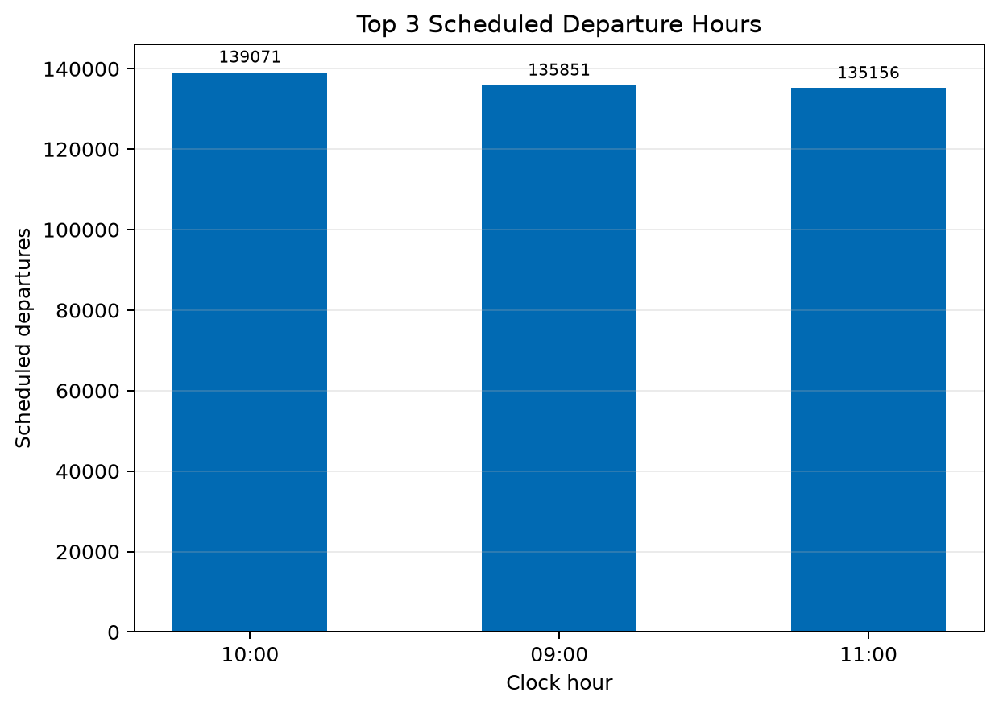
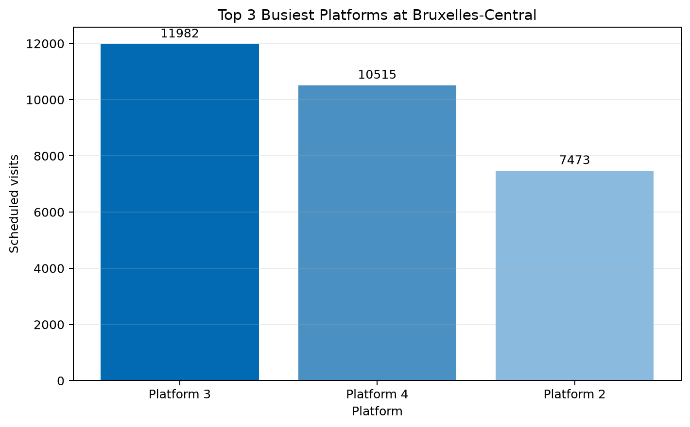
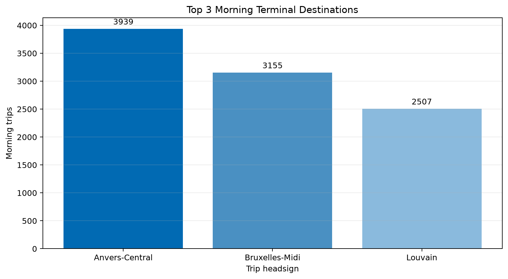
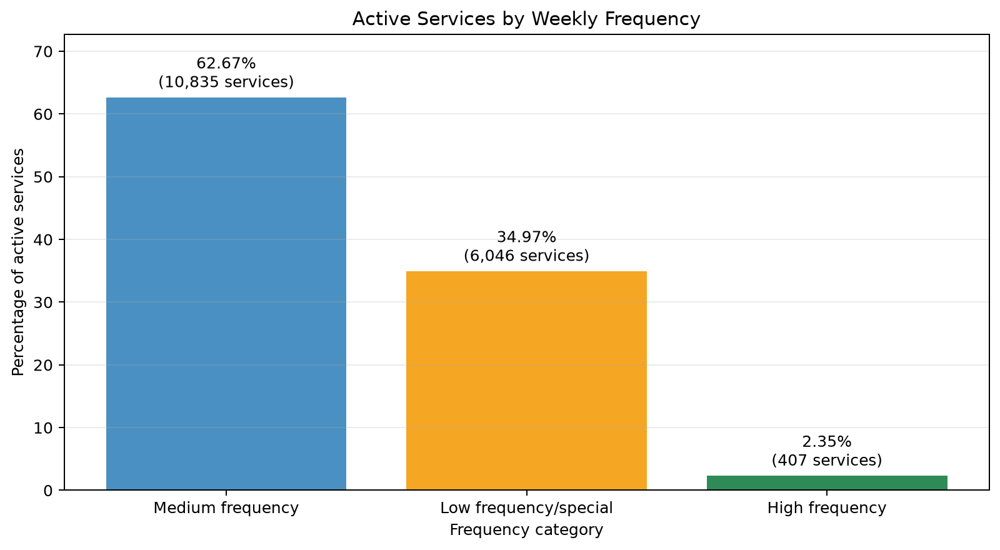
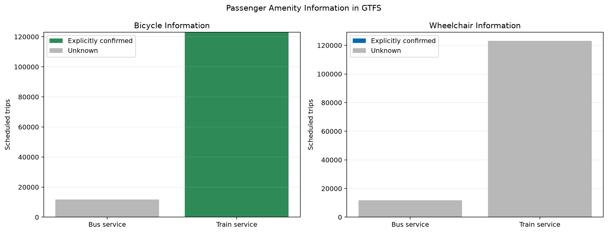

# RailPulse: Belgian Transit SQL Analysis

RailPulse is a SQL learning project that transforms SNCB/NMBS GTFS static schedule data into a normalized SQLite database and uses SQL to investigate network activity, station bottlenecks, service frequency, and passenger amenities.

The project was completed as part of the BeCode database curriculum. Python is used only to validate and import the source files and to execute SQL; all five analytical questions are answered with SQL queries.

## Project objectives

- Design a normalized relational schema from GTFS source files.
- Enforce primary keys, composite keys, and foreign-key relationships.
- Import and clean large text-based datasets without pandas.
- Analyse scheduled railway operations using joins, CTEs, aggregation, date/time functions, `CASE WHEN`, and window functions.
- Document data-quality limitations without treating missing values as negative facts.

## Data source

The project uses SNCB/NMBS GTFS static data from the [Belgian Mobility Open Data Portal](https://data.belgianmobility.io/en/data.html).

The following GTFS files are imported:

| Source file | SQLite table |
|---|---|
| `agency.txt` | `agencies` |
| `routes.txt` | `routes` |
| `calendar.txt` | `services` |
| `calendar_dates.txt` | `service_exceptions` |
| `stops.txt` | `stops` |
| `trips.txt` | `trips` |
| `stop_times.txt` | `stop_times` |

The downloaded data and generated SQLite database are intentionally excluded from Git because they are large and can be rebuilt locally.

## Database architecture

The database contains seven normalized tables:

- `agencies` stores the transport operator.
- `routes` stores route definitions and references `agencies`.
- `services` stores regular service calendars.
- `service_exceptions` stores individual operating dates and references `services`.
- `stops` stores stations, platforms, and parent-station relationships.
- `trips` connects routes to services.
- `stop_times` connects trips to ordered stops and scheduled times.

Composite primary keys are used where one source column is not unique:

- `service_exceptions`: `(service_id, exception_date)`
- `stop_times`: `(trip_id, stop_sequence)`

Detailed column types, key definitions, and examples are available in [docs/table_schema.md](docs/table_schema.md). The executable SQLite schema is in [docs/First_diagram.sql](docs/First_diagram.sql).

## Entity Relationship Diagram


The editable DrawDB representation is available in [docs/railpulse_drawdb.json](docs/railpulse_drawdb.json).

## Imported database

The completed local database contains:

| Table | Rows |
|---|---:|
| `agencies` | 1 |
| `routes` | 1,801 |
| `services` | 51,593 |
| `service_exceptions` | 4,697,139 |
| `stops` | 2,895 |
| `trips` | 134,809 |
| `stop_times` | 2,165,519 |

The final ingestion completed with SQLite foreign-key enforcement enabled, and `PRAGMA foreign_key_check` returned no violations.

## Project structure

```text
railpulse_sql_analysis/
├── database/                 # Generated railpulse.db (ignored by Git)
├── docs/
│   ├── First_diagram.sql     # SQLite table definitions
│   ├── railpulse_drawdb.json # Editable ERD
│   ├── table_schema.md       # Table and column documentation
│   ├── visual/               # SQL-backed analytical charts
│   └── session_*.md          # Analysis methodology and limitations
├── notebooks/
│   └── sql_analysis.ipynb    # Interactive SQL development notebook
├── SNCB_text_data/           # Downloaded GTFS files (ignored by Git)
├── sql/
│   └── analysis/             # One final SQL file per core question
└── src/
    ├── create_database.py     # Creates tables from the schema
    ├── create_visual.py       # Generates charts from SQL results
    ├── ingest_config.py       # File, column, type, and key configuration
    ├── ingest_data.py         # Validates, cleans, and imports GTFS data
    └── run_query.py           # Small SQLite query helper
```

## Requirements

- Python 3.10 or newer
- SQLite, provided through Python's standard `sqlite3` module
- Matplotlib for generating analytical charts
- SNCB/NMBS GTFS static source files
- Optional: VS Code with Jupyter support or Jupyter Notebook to run the analysis notebook

The database creation and ingestion scripts use only Python's standard library. Matplotlib is the only third-party dependency and is used by the visualization script.

## Setup

### 1. Clone the repository

```bash
git clone https://github.com/alexandrejeonghwankim-lab/railpulse_sql_analysis.git
cd railpulse_sql_analysis
```

### 2. Create and activate a virtual environment

Windows PowerShell:

```powershell
python -m venv .venv
.\.venv\Scripts\Activate.ps1
```

macOS or Linux:

```bash
python3 -m venv .venv
source .venv/bin/activate
```

Install the visualization dependency:

```bash
python -m pip install -r requirements.txt
```

### 3. Download the GTFS data

Download the SNCB/NMBS GTFS static dataset from the Belgian Mobility Open Data Portal and extract the required `.txt` files into:

```text
SNCB_text_data/SNCB_GTFS/
```

The directory must contain:

```text
agency.txt
routes.txt
calendar.txt
calendar_dates.txt
stops.txt
trips.txt
stop_times.txt
```

### 4. Create the SQLite database

From the project root, run:

```bash
python src/create_database.py
```

This reads `docs/First_diagram.sql` and creates:

```text
database/railpulse.db
```

### 5. Validate and import the GTFS files

```bash
python src/ingest_data.py
```

The importer:

1. validates the required source files and columns;
2. converts empty strings to SQL `NULL`;
3. converts GTFS dates from `YYYYMMDD` to ISO `YYYY-MM-DD`;
4. converts integer and decimal fields to suitable Python values;
5. imports tables in foreign-key-safe order using batches;
6. performs idempotent upserts;
7. runs a final foreign-key check.

The complete import can take time because `service_exceptions` and `stop_times` contain millions of rows.

## Running the analysis

The five final queries are stored in `sql/analysis`. They can be executed with a SQLite client connected to:

```text
database/railpulse.db
```

For interactive development, open [notebooks/sql_analysis.ipynb](notebooks/sql_analysis.ipynb), run the setup cells, and then run the relevant session.

Generate all five SQL-backed charts with:

```bash
python src/create_visual.py
```

The PNG files are written to `docs/visual/`.

## Analytical results

### 1. Peak Hour Problem

**Question:** What hour has the highest volume of scheduled departures across the network?

GTFS permits service-day times beyond `23:59:59`, so the query converts the hour to an integer and normalizes it with modulo 24.

| Rank | Hour | Scheduled departures |
|---:|---:|---:|
| 1 | 10:00 | 139,071 |
| 2 | 09:00 | 135,851 |
| 3 | 11:00 | 135,156 |

The top-three comparison provides context while 10:00 remains the answer to the original peak-hour question.



Query: [sql/analysis/01_peak_hour.sql](sql/analysis/01_peak_hour.sql)

### 2. Platform Bottlenecks

**Question:** Which three platforms have the most scheduled visits at Bruxelles-Central?

| Rank | Platform | Scheduled visits |
|---:|---:|---:|
| 1 | 3 | 11,982 |
| 2 | 4 | 10,515 |
| 3 | 2 | 7,473 |

Rows without a platform code are excluded from the ranking.



Query: [sql/analysis/02_platform_bottlenecks.sql](sql/analysis/02_platform_bottlenecks.sql)

### 3. Busiest Morning Destinations

**Question:** Which terminal destinations occur most frequently among trips whose first departure is before noon?

The query first identifies the minimum `stop_sequence` for every trip. It then uses the departure time at that first stop rather than counting departures from every intermediate stop.

| Rank | Destination | Morning trips |
|---:|---|---:|
| 1 | Anvers-Central | 3,939 |
| 2 | Bruxelles-Midi | 3,155 |
| 3 | Louvain | 2,507 |

Extended GTFS hours are normalized to clock time before applying the morning filter.



Query: [sql/analysis/03_morning_destinations.sql](sql/analysis/03_morning_destinations.sql)

### 4. Service Frequency

**Question:** What percentage of active service IDs belongs to each weekly-frequency category?

The weekday flags in `calendar.txt` are all zero in the supplied feed. The analysis therefore uses operating dates from `calendar_dates.txt`. An active service is defined as a `service_id` referenced by at least one scheduled trip.

| Frequency category | Active services | Percentage |
|---|---:|---:|
| Medium frequency | 10,835 | 62.67% |
| Low frequency/special | 6,046 | 34.97% |
| High frequency | 407 | 2.35% |

The displayed percentages total 99.99% because they are rounded to two decimal places.



Query: [sql/analysis/04_service_frequency.sql](sql/analysis/04_service_frequency.sql)  
Methodology: [docs/session_4_service_frequency.md](docs/session_4_service_frequency.md)

### 5. Accessibility Audit

**Question:** What ratio and percentage of scheduled trips per route explicitly guarantee wheelchair accessibility or bicycle accommodation, and which routes score lowest?

The GTFS data produces a clear data-quality distinction:

| Service and feature | Result |
|---|---|
| Train bicycle accommodation | Confirmed for all 123,051 scheduled train trips |
| Bus bicycle accommodation | Unknown for all 11,758 scheduled bus trips |
| Train wheelchair accessibility | Unknown |
| Bus wheelchair accessibility | Unknown |

All 1,531 train routes score 100% for the combined explicit amenity guarantee because every scheduled train trip has `bikes_allowed = 1`. This means accommodation for at least one bicycle is explicitly recorded; it does not prove the presence of a dedicated bicycle wagon.

All 270 bus routes score 0% for an **explicitly documented** combined guarantee because both relevant fields are missing. This is not proof that the amenities are unavailable. It means their status is unknown in the supplied GTFS records.

Wheelchair accessibility cannot be ranked because `wheelchair_accessible` is `NULL` for all 134,809 trips. Consequently, no train route is uniquely lowest: train routes are tied at 100%, while bus routes are tied at 0% documented availability.



Query: [sql/analysis/05_accessibility_audit.sql](sql/analysis/05_accessibility_audit.sql)  
Methodology: [docs/session_5_accessibility_audit.md](docs/session_5_accessibility_audit.md)  
Replacement-bus investigation: [docs/replacement_bus_hypothesis.md](docs/replacement_bus_hypothesis.md)

## SQL concepts demonstrated

- Inner and self-referencing joins
- `GROUP BY` and aggregate functions
- Common table expressions
- Conditional aggregation with `CASE WHEN`
- Composite primary keys
- Date and time extraction with SQLite functions
- Window aggregation for category percentages
- Idempotent upserts with `ON CONFLICT`
- Foreign-key validation

## Assumptions and limitations

- The analysis describes one downloaded GTFS static schedule and not live railway performance.
- Scheduled visits are not the same as actual passenger demand.
- Extended GTFS times are normalized to clock hours for the peak-hour and morning analyses.
- Session 4 uses `calendar_dates.txt` because the regular weekday flags contain no usable variation.
- Partial first or last service weeks may reduce an average weekly frequency.
- Missing GTFS values are treated as unknown, never automatically as unavailable.
- The dataset contains no trip-level wheelchair information.
- Bus services are identified through `route_short_name = 'BUS'`. The likely replacement-bus interpretation is supported by the data and SNCB documentation, but the internal `BBUS` identifier is not defined by the general GTFS specification.

## Documentation

- [Table schema](docs/table_schema.md)
- [SQL and database theory study guide](SQL&DB_theory.md)
- [Session 4 methodology](docs/session_4_service_frequency.md)
- [Session 5 accessibility audit](docs/session_5_accessibility_audit.md)
- [Replacement-bus hypothesis](docs/replacement_bus_hypothesis.md)
- [GTFS Schedule reference](https://gtfs.org/documentation/schedule/reference/)

## Nice-to-have work not included

The following items were intentionally left outside the must-have scope:

- daily GTFS or real-time API ingestion;
- a Streamlit dashboard;
- a multi-station performance leaderboard;
- query-plan and index optimization.

## Contributor

**Alexandre Jeonghwan Kim** — database design, Python ingestion pipeline, SQL analysis, validation, and documentation.

## Timeline and reflection

This four-day learning project was developed incrementally:

1. studied GTFS tables and designed the relational schema;
2. created the SQLite database and batch ingestion pipeline;
3. validated keys, source values, and relationships;
4. developed and tested the five SQL analyses;
5. documented assumptions, data-quality problems, and results.

The most important learning outcome was that a valid SQL result still requires careful interpretation. In particular, a `NULL` accessibility value means “unknown,” not “unavailable,” and a service-frequency result depends on a clearly stated definition of an active service.

## License and data ownership

This repository contains learning-project source code and documentation. SNCB/NMBS and the Belgian Mobility Open Data Portal retain ownership and licensing authority over the source transport data. Consult the portal before redistributing downloaded datasets.
